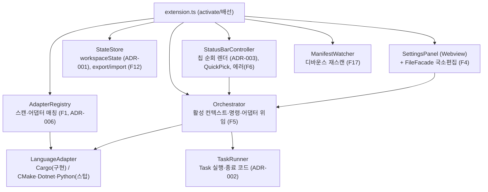

# Domain Model

> 도메인 모델 — 확장의 구성 요소, 관계, 불변식. (이 프로젝트의 "도메인"은 다언어 빌드/디버그 오케스트레이션 자체다.)

---

## 문서 정보

| 항목 | 내용 |
|------|------|
| 관련 Intent | INT-001 |
| Bounded Context | DevSwitcher Extension Host (단일 컨텍스트) |
| 버전 | v1 (상세설계서 §3 반입) |
| 검토 | 2026-08-13 Human Approved (Gate 3) |

---

## 1. Ubiquitous Language

전체 용어는 `02_project_definition/domain_glossary.md`를 기준으로 한다. 핵심 모델 용어:

| 용어 | 정의 | 영문 |
|------|------|------|
| 어댑터 | 언어별 빌드/디버그/실행/생성 로직 캡슐화 | LanguageAdapter |
| 칩 | 상태바의 선택 축(프로파일·아키텍처·타깃 등) | ChipDescriptor |
| 프로젝트 | 감지된 언어 프로젝트 단위 | ProjectInfo |
| 선택 상태 | 프로젝트별 칩 선택 + 실행 인자 | Selection |

---

## 2. 컴포넌트 구성 (상세설계 §3.1)

**의존 방향**: UI(StatusBar/SettingsPanel) → Orchestrator → Adapter. **역방향 금지.**

---

## 3. 핵심 엔티티 / 값

### Entity: `ProjectInfo` (감지된 프로젝트)
- id(`adapterId:상대경로`, 기계 독립), name, adapterId, manifestPath, workspaceFolder.

### Value: `Selection` (프로젝트별 선택 상태)
- projectId, values(chipId→ChipValue), runArgs. 값이 아니라 **선택만** 보유(SSOT, ADR-007).

### Value: `ChipDescriptor` (어댑터가 선언하는 칩)
- id·icon·label·multiSelect·required·listItems·format·defaultValue.

### 참조: 값의 원천(캐노니컬 파일)
- 프로파일/아키텍처/타깃의 실제 정의는 `Cargo.toml` 등 캐노니컬 파일에만 존재. 확장은 포인터만 소유.

---

## 4. 도메인 서비스

| 서비스 | 책임 | 입력 | 출력 |
|--------|------|------|------|
| AdapterRegistry | 워크스페이스 글롭 스캔 → 어댑터 매칭 | workspaceFolders | `{project, adapter}[]` |
| Orchestrator | 명령 처리, required 칩 검증, 어댑터 위임 | 명령 + 활성 컨텍스트 | Task/Debug 기동 |
| TaskRunner | Task 실행·종료 코드 대기 | `vscode.Task` | `TaskResult` |
| StateStore | 선택 상태 저장·복원·reconcile·export/import | PersistedState | Selection |
| ManifestWatcher | 매니페스트 변경 감지 → 재스캔 | FS 이벤트 | 재스캔 트리거 |
| Doctor | 전제조건 점검·복구 액션 | 활성 어댑터 | 진단 목록 |

---

## 5. 불변식 (Invariants)

- **INV-1 (SSOT)**: 값은 캐노니컬 파일에만, 확장은 포인터+선택만 보유 (ADR-007).
- **INV-2 (어댑터 무지 UI)**: StatusBar/SettingsPanel은 특정 언어를 모른다 — `ChipDescriptor[]`만 순회 (ADR-003).
- **INV-3 (단일 갱신 경로)**: 매니페스트 변경·persistSetting 쓰기 모두 ManifestWatcher 경로로 수렴 (F17).
- **INV-4 (한 창 = 한 환경)**: 한 VSCode 창은 하나의 실행 환경에만 연결 (§12.4).
- **INV-5 (프로젝트별 선택 독립)**: 프로젝트 전환 시 각자의 마지막 선택 복원.

---

## 6. 도메인 이벤트

| 이벤트 | 트리거 | 처리 |
|--------|--------|------|
| 프로젝트 감지 변경 | 매니페스트 create/delete, 폴더 추가/제거 | 재스캔 → reconcile → 렌더 |
| 매니페스트 변경 | Cargo.toml change | 캐시 무효화 → 렌더 |
| 선택 변경 | 칩 QuickPick 선택 | StateStore 저장 → 렌더 |
| 프로젝트 생성 (F20) | 시작 마법사 완료 | 새 매니페스트 감지 → 자동 등장 |

---

## 7. 가정 (Assumptions)

| ID | 가정 | 영향 |
|----|------|------|
| ASM-001 | 단일 Bounded Context(확장 호스트 프로세스) | 컴포넌트 간 in-process 호출 |

---

## 8. 미확정 사항 (Open Questions)

| ID | 항목 | 질문 | 상태 |
|----|------|------|------|
| OQ-001 | 혼재 워크스페이스 칩 전환 UX(R6) | 칩 표시/숨김 전환이 혼란스러운가 | Deferred |

---

## 9. 관련 근거 / 출처

| ID | 근거 | 출처 | 비고 |
|----|------|------|------|
| SRC-001 | 컴포넌트 구성·의존 방향 | 상세설계서 §3 | 원문 |
| SRC-002 | 불변식·서비스 책임 | 상세설계서 §5~§9, ADR-001~010 | 반입 |
