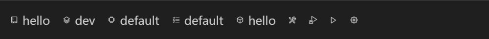
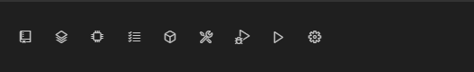

# DevSwitcher Tools

> 여러 언어 프로젝트를 **하나의 상태바 UX**로 전환·빌드·실행·디버그하는 VSCode 확장.
> 언어별 차이는 어댑터 뒤로 숨기고, 사용자는 상태바의 칩과 버튼만 다룹니다.



Compact 모드(아이콘 전용) — 좁은 창용:



---

## 무엇을 하나요

- **상태바 = 프로젝트 대시보드.** 활성 프로젝트, 빌드 프로파일, 아키텍처(target), features, 실행 대상을 상태바 칩으로 한눈에 보고 클릭 한 번으로 바꿉니다.
- **빌드 / 실행 / 디버그**를 상태바 버튼으로 바로 트리거합니다. 터미널 명령을 외울 필요가 없습니다.
- **설정 페이지**(Webview)에서 컴파일 옵션·링커·환경변수·빌드 전후 명령을 **파일을 건드리지 않고** `(프로젝트 × 구성)`별로 저장합니다.
- **Doctor**가 툴체인·확장 설치 상태를 진단하고 해결 방법을 안내합니다.
- **프로파일 export / import**로 선택·구성 상태를 파일로 주고받습니다.

## 지원 범위 (v1)

| 언어 | 상태 | 비고 |
|------|------|------|
| **Rust (Cargo)** | ✅ 실구현 | 빌드·실행·디버그·아키텍처(target)·features·호출 구성 전부 동작 |
| C++ (CMake) · C# (.NET) · Python | 🚧 스텁 | 칩 선언만 — 후속 버전에서 실구현 |

> 아키텍처상 언어는 `LanguageAdapter` + `ChipDescriptor[]` 뒤로 숨겨져 있어, 어댑터만 추가하면 상태바/설정/실행 코드를 건드리지 않고 새 언어를 붙일 수 있습니다.

## 요구사항

- **VSCode** 1.90.0 이상
- **Rust 툴체인** — [`rustup`](https://rustup.rs) + `cargo` (PATH에 있어야 함)
- **디버그 시** — [CodeLLDB](https://marketplace.visualstudio.com/items?itemName=vadimcn.vscode-lldb) 확장 (미설치 시 디버그 실행할 때 온디맨드로 설치 안내)
- 크로스 컴파일 아키텍처는 상태바 **Architecture** 칩에서 `rustup target add`를 통해 바로 설치할 수 있습니다.

## 설치

개인용 v0.1은 VSIX로 배포합니다:

```bash
code --install-extension devswitcher-tools-0.1.0.vsix
```

또는 VSCode에서 **Extensions** 뷰 → `...` 메뉴 → **Install from VSIX...** → `.vsix` 선택.

## 사용법

### 상태바 칩

`Cargo.toml`이 있는 폴더를 열면 상태바(왼쪽)에 칩이 나타납니다:

| 칩 | 의미 | 클릭하면 |
|----|------|----------|
| `$(repo)` 프로젝트 | 활성 cargo 프로젝트 | 워크스페이스의 다른 프로젝트로 전환 |
| `$(layers)` Profile | 빌드 프로파일 (dev / release …) | 프로파일 선택 |
| `$(chip)` Architecture | 대상 target triple (`default` = 호스트) | 설치된 target 선택 / 미설치 target 설치 |
| `$(checklist)` Features | cargo features | features 다중 선택 |
| `$(symbol-method)` Target | 실행할 바이너리 (required) | 실행 대상 선택 |
| `$(tools)` `$(debug-alt)` `$(play)` | Build · Debug · Run | 해당 동작 실행 |
| `$(gear)` | 설정 페이지 열기 | 설정 페이지 |

> 툴체인 문제가 있으면 `$(warning) Toolchain` 경고 칩이 나타나며, 클릭하면 Doctor가 열립니다.

### 명령 (Command Palette)

`Ctrl+Shift+P` → `DevSwitcher:` 로 모두 접근할 수 있습니다. (기본 단축키는 충돌 방지를 위해 비워 두었으니, 필요하면 **Keyboard Shortcuts**에서 직접 바인딩하세요.)

| 명령 | 설명 |
|------|------|
| `DevSwitcher: Switch Project` | 활성 프로젝트 전환 |
| `DevSwitcher: Build` / `Run` / `Debug` | 빌드 / 실행 / 디버그 |
| `DevSwitcher: Open Settings` | 설정 페이지 열기 |
| `DevSwitcher: Doctor (environment diagnostics)` | 환경 진단 |
| `DevSwitcher: Export Profile` / `Import Profile` | 프로파일 내보내기 / 가져오기 |
| `DevSwitcher: Toggle Compact Status Bar` | Compact(아이콘 전용) 모드 토글 |

### 설정 페이지

`$(gear)` 또는 **Open Settings** 명령으로 엽니다. 좌측 탭에서:

- **General** — 상태바 표시 옵션(compact / selectedOnly) 토글
- **Features / 옵션 카탈로그** — 컴파일 옵션·링커·출력 경로·환경변수를 어댑터가 선언한 카탈로그에서 골라 편집. 각 옵션은 설명·예제·공식 문서 링크를 제공합니다.
- **Build Events** — pre/postBuild 명령(줄당 하나). preBuild 실패 시 빌드가 중단됩니다.
- **명령 미리보기** — 현재 선택·구성으로 실제 실행될 `cargo` 명령(환경변수 주입 포함)을 실시간으로 보여줍니다.

여기서 편집한 값은 캐노니컬 파일(`Cargo.toml` 등)을 **수정하지 않고** 확장 내부에 `(프로젝트 × 프로파일)`별로 저장되어, 빌드/실행 시 `--config` / `RUSTFLAGS` / 환경변수로 주입됩니다.

## 설정 (Settings)

| 설정 | 기본값 | 설명 |
|------|--------|------|
| `devSwitcher.statusBar.compact` | `false` | 칩을 아이콘만 표시(값은 hover/클릭). 좁은 창에 유용 |
| `devSwitcher.statusBar.selectedOnly` | `false` | 값이 없는 optional 칩 숨김(required 칩은 유지) |

## 알려진 한계

- **한 창 = 한 환경.** VSCode 한 창은 하나의 실행 환경에만 연결됩니다. 같은 창에서 칩 전환으로 Windows MSVC ↔ WSL gcc 를 오가는 것은 지원하지 않습니다 — 같은 레포를 두 창(Windows / WSL)으로 여는 패턴을 권장합니다.
- **WSL**에서 레포가 `/mnt/...`(9p 파일시스템)에 있으면 빌드가 느립니다. WSL 파일시스템 내부에 두는 것을 권장합니다.
- v1은 **Rust만 실구현**입니다. C++/C#/Python 칩은 아직 선언 스텁입니다.

## 개발 (Development)

```bash
npm install
npm run compile          # esbuild 번들 → dist/extension.js
npm run check-types      # tsc --noEmit
npm run test:unit        # 순수 코어 단위 테스트 (mocha)
npm run test:integration # VSCode 호스트 통합 테스트
npx @vscode/vsce package # devswitcher-tools-<ver>.vsix 생성
```

VSCode에서 **F5**로 Extension Development Host를 띄워 실제 동작을 확인합니다.
설계·협업 문서는 [`.cowork/`](.cowork/)에 있습니다(AI–Human Cowork 프레임워크).

핵심 아키텍처: `LanguageAdapter` + 선언형 `ChipDescriptor[]`로 UI를 언어 무지하게 유지(ADR-003),
SSOT 파사드(ADR-007), 호출 구성 오버레이(ADR-011), Task API 실행 + `workspaceState` 저장.

## 라이선스

[MIT](LICENSE) © 2026 Seunghyun
