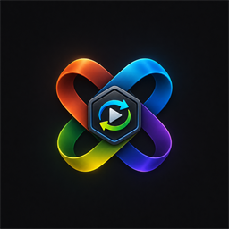
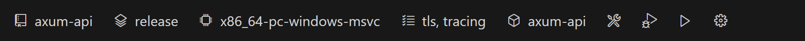
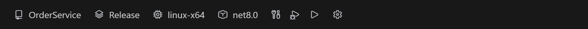
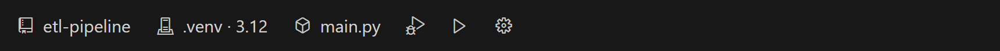
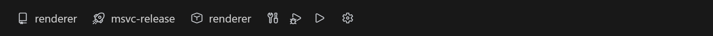

<div align="center">



# DevSwitcher Tools

**Switch, build, run, and debug Rust, C#, Python, C++, Go, and Node.js/TypeScript projects from a single status bar — each through its own native toolchain, without editing a single build file.**

[](https://code.visualstudio.com/)
[](LICENSE)


</div>


DevSwitcher Tools turns the VS Code status bar into a project cockpit. Pick the active
project, build profile, target, and other options as **chips**; then **Build**, **Run**, or
**Debug** with a click. It's the same workflow whether the project is Cargo, .NET, Python,
CMake, Go, or Node — under the hood the extension drives each toolchain's own CLI and resolves
paths from real build output, so **your `Cargo.toml`, `.csproj`, `CMakeLists.txt`,
`pyproject.toml`, `go.mod`, and `package.json` are never touched.**

---

## Features

- **Six languages, one UX.** Rust (Cargo), C# (.NET), Python, C++ (CMake), Go, and
  Node.js/TypeScript all appear in the same switcher. Adding a language is an adapter — the UI
  never learns which language it's showing.
- **Chips instead of commands.** The active project and its build options (profile, target,
  architecture, features, interpreter, CMake preset, npm script, package manager…) are
  status-bar chips you click to change — no memorizing per-toolchain flags.
- **Build / Run / Debug buttons.** One click each. Debug auto-selects the right debugger for
  the toolchain (e.g. CodeLLDB for Rust, `cppvsdbg`/`gdb`/`lldb` for CMake by compiler, coreclr
  for .NET, debugpy for Python, delve for Go, the built-in js-debug for Node/TypeScript) and
  installs the needed extension on demand.
- **Per-config settings, zero file edits.** A settings page lets you set compiler flags,
  linker flags, output dirs, environment variables, and pre/post-build commands. They're
  stored per _(project × profile)_ and injected at invocation time (`--config`, `-p:`, `-D`,
  `RUSTFLAGS`, env…) — the canonical build file is never modified.
- **CMake presets, first-class.** When a project has `CMakePresets.json`, a **Preset** chip
  replaces the profile/architecture chips and `cmake --preset` drives configure — switch
  compilers (MSVC ↔ Clang-CL ↔ GCC) by picking a preset.
- **Doctor.** One command diagnoses your toolchains and debug extensions and points you to
  the fix; a warning chip lights up when something critical is missing.
- **Run groups.** Start several projects together in dependency order — e.g. `auth → api →
  web` — from one click. Each member runs in a **stage**; same stage starts in parallel, a
  higher stage waits until the previous stage's processes have launched. Stop them all with
  one command.
- **Profiles export / import.** Share your chip selections and per-config overlays as a
  portable `devswitcher.profile.json`.
- **New Project wizard.** `DevSwitcher: New Project…` scaffolds a starter project in any
  supported language (folder → language → name).

## Supported languages

| Language | Detected by | Build | Run | Debug | Toolchain · debug extension |
| --- | --- | :---: | :---: | :---: | --- |
| **Rust (Cargo)** | `Cargo.toml` | ✅ | ✅ | ✅ | `rustup` + `cargo` · CodeLLDB |
| **C# (.NET)** | `*.csproj` | ✅ | ✅ | ✅ | .NET SDK · C# Dev Kit (coreclr) |
| **Python** | `pyproject.toml` | — | ✅ | ✅ | Python interpreter · Python extension (debugpy) |
| **C++ (CMake)** | `CMakeLists.txt` | ✅ | ✅ | ✅ | `cmake` + a C++ compiler · C/C++ (auto) or CodeLLDB |
| **Go** | `go.mod` | ✅ | ✅ | ✅ | Go toolchain · Go extension (delve) |
| **Node.js / TypeScript** | `package.json` | ✅ | ✅ | ✅ | Node.js · built-in js-debug (no extension) |

Python has no build step — it runs the interpreter directly. Node.js runs your **npm scripts**
(`<pm> run <script>`), so its debugger and build step come from the scripts themselves — and
its debugger (js-debug) ships with VS Code, so no extension install is needed. Debug extensions
are prompted for on demand the first time you debug; you only need the toolchains for languages
you use.

<details>
<summary><b>See each language's status bar</b></summary>

<br>

**Rust (Cargo)** — project · profile · target triple · features · binary



**C# (.NET)** — project · configuration · runtime identifier · target framework



**Python** — project · interpreter/venv · script (no build button — the interpreter runs directly)



**C++ (CMake)** — project · preset · executable (a `CMakePresets.json` preset replaces the profile/architecture chips)



**Go** — project · package (the module's `main` package to build, run, or debug)

<br>

**Node.js / TypeScript** — project · script (the npm script to run/debug) · package manager (npm/pnpm/yarn, auto-detected)

</details>

## Requirements

- **VS Code 1.90+**
- Per language, on your `PATH`: **Rust** → `rustup`/`cargo`; **C#** → the .NET SDK;
  **Python** → a Python interpreter; **C++** → `cmake` plus a compiler (MSVC, GCC, or Clang);
  **Go** → the Go toolchain (`go`); **Node.js/TypeScript** → Node.js (and your package manager:
  npm, pnpm, or yarn).

Run **`DevSwitcher: Doctor`** at any time to see what's detected and what's missing.

## Install

This extension is distributed as a `.vsix`:

```bash
code --install-extension devswitcher-tools-0.6.0.vsix
```

Or in VS Code: **Extensions** view → `⋯` menu → **Install from VSIX…** → pick the file.

## Usage

Open a folder containing a supported manifest and the DevSwitcher chips appear at the left of
the status bar.

### Status bar

| Element | What it does |
| --- | --- |
| `$(repo)` **Project** | The active project — click to switch between projects in the workspace. |
| **Option chips** | Per-language build options (profile/configuration, architecture/target, features, Python environment, CMake preset…). Click to change; a required chip glows until set. |
| `$(symbol-method)` **Target** | The binary/executable/script to run or debug. |
| `$(tools)` `$(debug-alt)` `$(play)` | **Build · Debug · Run.** |
| `$(run-all)` **Groups** | Appears when a run group is defined — click to run, stop, or stop all groups. |
| `$(gear)` | Open the settings page. |
| `$(warning) Toolchain` | Appears when a critical tool is missing — click to run Doctor. |

### Commands

All commands live under **`DevSwitcher:`** in the Command Palette (`Ctrl/Cmd+Shift+P`).
Default keybindings are intentionally unset — bind the ones you use in **Keyboard Shortcuts**.

| Command | Description |
| --- | --- |
| **Switch Project** | Change the active project. |
| **Build** / **Run** / **Debug** | Run the action on the active project. |
| **Open Settings** | Open the settings page. |
| **Doctor (environment diagnostics)** | Diagnose toolchains and debug extensions. |
| **Rescan Projects** | Force a re-scan when a folder moved or changed outside the editor. |
| **New Project…** | Scaffold a new project (folder → language → name). |
| **Run Groups…** | Run or stop a run group (or stop all) from one menu. |
| **Export Profile** / **Import Profile** | Save or load selections + overlays as JSON. |
| **Toggle Compact Status Bar** | Icon-only chips for narrow windows. |

### Settings page & the invocation overlay

Open it with the `$(gear)` chip or **Open Settings**. From the tabs you can edit compiler and
linker flags, output directories, environment variables, and pre/post-build commands, each
with inline help and a **live command preview** of exactly what will run. Everything you set
is stored per _(project × profile)_ inside the extension and injected at build/run time — the
canonical build files stay untouched (profiles are read-only here by design).

### Run groups

Open the settings page → **Run Groups** tab to define a group: name it, check the projects to
include, and give each a **Stage** number. Members with the same stage start together; a higher
stage waits until every lower stage's process has launched — so `auth (1) → api (2) → web (3)`
starts each service in order, while two members sharing a stage run in parallel.

Run or stop a group from the group's **Run**/**Stop** button, the status-bar `$(run-all)`
launcher, or **`DevSwitcher: Run Groups…`** (which also offers **Stop all**). A member that is
already running — individually or in another group — is treated as ready and skipped, so the
rest of the group still starts. Readiness in this release means the member's process has
launched; port/health-check readiness is planned.

## Extension settings

| Setting | Default | Description |
| --- | --- | --- |
| `devSwitcher.statusBar.compact` | `false` | Show chips as icons only (value on hover/click). |
| `devSwitcher.statusBar.selectedOnly` | `false` | Hide optional chips that have no value (required chips stay). |
| `devSwitcher.cmake.debugger` | `auto` | Which debugger the CMake adapter uses: `auto` (from the compiler), `cpptools`, or `codelldb`. |

## Known limitations

- **One window, one environment.** A VS Code window is bound to a single execution
  environment; switching chips won't cross Windows MSVC ↔ WSL GCC. Open the repo in two
  windows (Windows / WSL) instead.
- On **WSL**, a repo under `/mnt/...` (9p filesystem) builds slowly — keep it inside the WSL
  filesystem.

## Development

```bash
npm install
npm run compile           # esbuild bundle → dist/extension.js
npm run check-types       # tsc --noEmit
npm run test:unit         # pure-core unit tests (mocha, no VS Code host)
npm run test:integration  # VS Code host integration tests
npx @vscode/vsce package  # build devswitcher-tools-<version>.vsix
```

Press **F5** in VS Code to launch the Extension Development Host. The architecture keeps the
UI language-agnostic behind `LanguageAdapter` + declarative `ChipDescriptor[]`, injects build
options at call time instead of editing files, runs everything through the VS Code Task API,
and persists state in `workspaceState` (no database).

## License

[MIT](LICENSE) © 2026 LIM SEUNG HYUN
