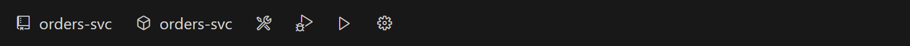
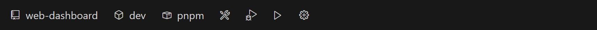

<div align="center">


# DevSwitcher Tools

**Switch, build, run, and debug Rust, C#, Python, C++ (CMake & Visual Studio), Go, and Node.js/TypeScript projects from a single status bar — each through its own native toolchain, without editing a single build file.**

[](https://code.visualstudio.com/)
[](LICENSE)


</div>


DevSwitcher Tools turns the VS Code status bar into a project cockpit. Pick the active
project, build profile, target, and other options as **chips**; then **Build**, **Run**, or
**Debug** with a click. It's the same workflow whether the project is Cargo, .NET, Python,
CMake, a Visual Studio solution, Go, or Node — under the hood the extension drives each
toolchain's own CLI and resolves paths from real build output, so **your `Cargo.toml`,
`.csproj`, `CMakeLists.txt`, `.sln`/`.vcxproj`, `pyproject.toml`, `go.mod`, and
`package.json` are never touched.**

---

## Features

- **Seven toolchains, one UX.** Rust (Cargo), C# (.NET), Python, C++ (CMake), C++
  (Visual Studio), Go, and Node.js/TypeScript all appear in the same switcher. Adding a
  language is an adapter — the UI never learns which language it's showing. Don't use some
  of them? Untick languages in the settings page's **General** tab
  (`devSwitcher.languages.enabled`) to hide them entirely.
- **Chips instead of commands.** The active project and its build options (profile, target,
  architecture, features, interpreter, CMake preset, npm script, package manager…) are
  status-bar chips you click to change — no memorizing per-toolchain flags.
- **Build / Run / Debug buttons.** One click each. Debug auto-selects the right debugger for
  the toolchain (e.g. CodeLLDB for Rust, `cppvsdbg`/`gdb`/`lldb` for CMake by compiler, coreclr
  for .NET, debugpy for Python, delve for Go, the built-in js-debug for Node/TypeScript) and
  installs the needed extension on demand.
- **Per-config settings, zero file edits.** A settings page lets you set compiler flags,
  linker flags, output dirs, environment variables, and pre/post-build commands. They're
  stored per _(project × profile)_ and injected at invocation time (`--config`, `-p:`, `-D`,
  `RUSTFLAGS`, env…) — the canonical build file is never modified.
- **CMake presets, first-class.** When a project has `CMakePresets.json`, a **Preset** chip
  replaces the profile/architecture chips and `cmake --preset` drives configure — switch
  compilers (MSVC ↔ Clang-CL ↔ GCC) by picking a preset.
- **Nested CMake projects, Visual-Studio style.** A `project()` root shows its
  `add_subdirectory` directories that declare targets as indented **sub-projects** in the
  switcher and settings. A sub-project builds through the root's build tree, and its
  **Target** picker is scoped to its own targets, and the root's picker adds an
  **All targets** entry that builds the whole tree at once. Library targets (static/shared)
  are listed and buildable too — running or debugging one shows a friendly toast instead,
  just like a VS library project (hide libraries via `devSwitcher.projects.showLibraries`).
- **Visual Studio solutions, natively.** `.sln`/`.slnx` solutions and their `.vcxproj` C++
  projects get the same status-bar UX — the solution is the root ("build all"), each project
  a sub-entry with **Configuration** and **Platform** chips, built by **MSBuild** (located
  via `vswhere`, Build Tools included) and debugged with `cppvsdbg`. Solutions generated by
  CMake's VS generator are automatically excluded (the CMake adapter keeps owning those
  build trees), and a solution's C# projects keep appearing as their own .NET entries.
- **Doctor.** One command diagnoses your toolchains and debug extensions and points you to
  the fix; a warning chip lights up when something critical is missing.
- **Run groups.** Start several projects together in dependency order — e.g. `auth → api →
  web` — from one click. Each member runs in a **stage**; same stage starts in parallel, a
  higher stage waits until the previous stage is **ready**. "Ready" is the process launching by
  default, or — per member — a **port opening** or an **HTTP health check** passing (with a
  timeout). Any member can **launch under the debugger** instead of a plain run (its readiness
  gate and group teardown apply the same). Stop them all with one command.
- **Profiles export / import.** Share your chip selections and per-config overlays as a
  portable `devswitcher.profile.json`.
- **New Project wizard.** `DevSwitcher: New Project…` scaffolds a starter project in any
  supported language (folder → language → name).

## Supported languages

| Language | Detected by | Build | Run | Debug | Toolchain · debug extension |
| --- | --- | :---: | :---: | :---: | --- |
| **Rust (Cargo)** | `Cargo.toml` | ✅ | ✅ | ✅ | `rustup` + `cargo` · CodeLLDB |
| **C# (.NET)** | `*.csproj` | ✅ | ✅ | ✅ | .NET SDK · C# Dev Kit (coreclr) |
| **Python** | `pyproject.toml` | — | ✅ | ✅ | Python interpreter · Python extension (debugpy) |
| **C++ (CMake)** | `CMakeLists.txt` | ✅ | ✅ | ✅ | `cmake` + a C++ compiler · C/C++ (auto) or CodeLLDB |
| **C++ (Visual Studio)** | `*.sln` / `*.slnx` / `*.vcxproj` | ✅ | ✅ | ✅ | MSBuild (Visual Studio or Build Tools) · C/C++ (cppvsdbg) — Windows |
| **Go** | `go.mod` | ✅ | ✅ | ✅ | Go toolchain · Go extension (delve) |
| **Node.js / TypeScript** | `package.json` | ✅ | ✅ | ✅ | Node.js · built-in js-debug (no extension) |

Python has no build step — it runs the interpreter directly. Node.js runs your **npm scripts**
(`<pm> run <script>`), so its debugger and build step come from the scripts themselves — and
its debugger (js-debug) ships with VS Code, so no extension install is needed. Debug extensions
are prompted for on demand the first time you debug; you only need the toolchains for languages
you use.

Visual Studio support is Windows-only and covers C++ (`.vcxproj`) projects: a solution's C#
projects stay owned by the .NET adapter (they appear as their own entries), and run/debug
path resolution uses MSBuild's own evaluation (`-getProperty:TargetPath`, MSBuild 17.8+ —
builds work on older MSBuild too).

<details>
<summary><b>See each language's status bar</b></summary>

<br>

**Rust (Cargo)** — project · profile · target triple · features · binary


**C# (.NET)** — project · configuration · runtime identifier · target framework


**Python** — project · interpreter/venv · script (no build button — the interpreter runs directly)


**C++ (CMake)** — project · preset · executable (a `CMakePresets.json` preset replaces the profile/architecture chips)


**Go** — project · package (the module's `main` package to build, run, or debug)



**Node.js / TypeScript** — project · script (the npm script to run/debug) · package manager (npm/pnpm/yarn, auto-detected)



</details>

## Requirements

- **VS Code 1.90+**
- Per language, on your `PATH`: **Rust** → `rustup`/`cargo`; **C#** → the .NET SDK;
  **Python** → a Python interpreter; **C++ (CMake)** → `cmake` plus a compiler (MSVC, GCC, or
  Clang); **C++ (Visual Studio)** → Visual Studio or Build Tools with the C++ workload
  (MSBuild is located via `vswhere` — no PATH setup needed); **Go** → the Go toolchain (`go`);
  **Node.js/TypeScript** → Node.js (and your package manager: npm, pnpm, or yarn).

Run **`DevSwitcher: Doctor`** at any time to see what's detected and what's missing.

## Install

From the [Visual Studio Marketplace](https://marketplace.visualstudio.com/items?itemName=lim8603.devswitcher-tools):
search for **DevSwitcher Tools** in the Extensions view, or:

```bash
code --install-extension lim8603.devswitcher-tools
```

Alternatively, grab the `.vsix` from [GitHub Releases](https://github.com/lim8603/dot-tools/releases):

```bash
code --install-extension devswitcher-tools-1.1.0.vsix
```

## Usage

Open a folder containing a supported manifest and the DevSwitcher chips appear at the left of
the status bar.

### Status bar

| Element | What it does |
| --- | --- |
| `$(repo)` **Project** | The active project — click to switch between projects in the workspace. |
| **Option chips** | Per-language build options (profile/configuration, architecture/target, features, Python environment, CMake preset…). Click to change; a required chip glows until set. |
| `$(symbol-method)` **Target** | The binary/executable/script to run or debug. |
| `$(tools)` `$(debug-alt)` `$(play)` | **Build · Debug · Run.** |
| `$(debug-stop)` **Stop** | Appears while a run/build task or debug session is active — click to stop it. |
| `$(run-all)` **Groups** | Appears when a run group is defined — click to run, stop, or stop all groups. |
| `$(gear)` | Open the settings page. |
| `$(warning) Toolchain` | Appears when a critical tool is missing — click to run Doctor. |

### Commands

All commands live under **`DevSwitcher:`** in the Command Palette (`Ctrl/Cmd+Shift+P`).

| Command | Description |
| --- | --- |
| **Switch Project** | Change the active project. |
| **Build** / **Run** / **Debug** | Run the action on the active project. |
| **Stop** | Terminate the active project's running task (e.g. a long-lived `run`). |
| **Open Settings** | Open the settings page. |
| **Doctor (environment diagnostics)** | Diagnose toolchains and debug extensions. |
| **Rescan Projects** | Force a re-scan when a folder moved or changed outside the editor. |
| **New Project…** | Scaffold a new project (folder → language → name). |
| **Run Groups…** | Run or stop a run group (or stop all) from one menu. |
| **Export Profile** / **Import Profile** | Save or load selections + overlays as JSON. |
| **Toggle Compact Status Bar** | Icon-only chips for narrow windows. |

### Keyboard shortcuts

The core actions ship with default keybindings (active only when a DevSwitcher project is
present, so they never clash in unrelated workspaces):

| Action | Windows / Linux | macOS |
| --- | --- | --- |
| Build | `Ctrl+Alt+B` | `Cmd+Alt+B` |
| Run | `Ctrl+Alt+R` | `Cmd+Alt+R` |
| Stop | `Ctrl+Alt+S` | `Cmd+Alt+S` |
| Debug | `Ctrl+Alt+D` | `Cmd+Alt+D` |
| Switch Project | `Ctrl+Alt+P` | `Cmd+Alt+P` |
| Switch Target | `Ctrl+Alt+T` | `Cmd+Alt+T` |
| Run Groups | `Ctrl+Alt+G` | `Cmd+Alt+G` |
| Open Settings | `Ctrl+Alt+,` | `Cmd+Alt+,` |

**Stop** terminates the active project's running task (handy for a long-lived `run` — a dev
server or watcher). **Switch Target** opens the active project's target picker (Node: the npm
script picker). **Run Groups** opens the group menu (run / stop / stop all).

Change any of them in VS Code's **Keyboard Shortcuts** editor — the settings page's **General**
tab lists them and links straight there (filtered to DevSwitcher). VS Code's built-in keys
(`F5` debug, `Ctrl+Shift+B` build task) are left untouched; if you'd rather drive DevSwitcher
with them, bind `devSwitcher.debug` to `F5` or `devSwitcher.build` to `Ctrl+Shift+B` in that
editor.

### Settings page & the invocation overlay

Open it with the `$(gear)` chip or **Open Settings**. From the tabs you can edit compiler and
linker flags, output directories, environment variables, and pre/post-build commands, each
with inline help and a **live command preview** of exactly what will run. Everything you set
is stored per _(project × profile)_ inside the extension and injected at build/run time — the
canonical build files stay untouched (profiles are read-only here by design).

### Run groups

Open the settings page → **Run Groups** tab to define a group: name it, then **add projects**
from the dropdown. Each member is a card with a **Launch** mode (Run, or **Debug** to start it
under its toolchain's debugger — breakpoints work while the rest of the group runs normally),
a **Stage** number, and a **Ready when** gate. Members with the same stage start together; a
higher stage waits until every lower stage is ready — so `auth (1) → api (2) → web (3)` starts
each service in order, while two members sharing a stage run in parallel.

**Ready when** decides what counts as "ready" for a member's dependents:

- **process start** (default) — ready as soon as the member's process launches (fast, no setup).
- **port open** — ready once a TCP connection to `localhost:<port>` succeeds.
- **HTTP status** — ready once `GET <url>` returns the expected status (default `200`).

Port/HTTP gates poll until they pass or the member's **timeout** elapses; a member that never
becomes ready aborts the group start and tears the started members back down. A long readiness
wait can be **cancelled** from the progress notification.

Run or stop a group from the group's **Run**/**Stop** button, the status-bar `$(run-all)`
launcher, or **`DevSwitcher: Run Groups…`** (which also offers **Stop all**). A member that is
already running — individually or in another group — is treated as ready and skipped, so the
rest of the group still starts.

## Extension settings

| Setting | Default | Description |
| --- | --- | --- |
| `devSwitcher.languages.enabled` | all | Languages scanned and shown. Remove a language to hide its projects (also editable as checkboxes in the settings page's General tab). An empty or invalid list falls back to all. |
| `devSwitcher.statusBar.compact` | `false` | Show chips as icons only (value on hover/click). |
| `devSwitcher.statusBar.selectedOnly` | `false` | Hide optional chips that have no value (required chips stay). |
| `devSwitcher.projects.showLibraries` | `true` | List library projects/targets (static/shared) in the switcher and Target picker. They build, but cannot run or debug. |
| `devSwitcher.cmake.debugger` | `auto` | Which debugger the CMake adapter uses: `auto` (from the compiler), `cpptools`, or `codelldb`. |

## Known limitations

- **One window, one environment.** A VS Code window is bound to a single execution
  environment; switching chips won't cross Windows MSVC ↔ WSL GCC. Open the repo in two
  windows (Windows / WSL) instead.
- On **WSL**, a repo under `/mnt/...` (9p filesystem) builds slowly — keep it inside the WSL
  filesystem.
- **WSL manual verification is pending** (known issue, v1.0.0) — the extension is built
  remote-safe (`workspace.fs`, runs on the workspace side), but the dedicated WSL manual test
  pass has not been run for this release. If you hit a WSL-specific problem, please
  [open an issue](https://github.com/lim8603/dot-tools/issues).

## Development

```bash
npm install
npm run compile           # esbuild bundle → dist/extension.js
npm run check-types       # tsc --noEmit
npm run test:unit         # pure-core unit tests (mocha, no VS Code host)
npm run test:integration  # VS Code host integration tests
npx @vscode/vsce package  # build devswitcher-tools-<version>.vsix
```

Press **F5** in VS Code to launch the Extension Development Host. The architecture keeps the
UI language-agnostic behind `LanguageAdapter` + declarative `ChipDescriptor[]`, injects build
options at call time instead of editing files, runs everything through the VS Code Task API,
and persists state in `workspaceState` (no database).

> **Note**: this is a personal project and does not accept external pull requests
> (they are closed automatically — see [CONTRIBUTING.md](CONTRIBUTING.md)).
> Bug reports and feedback via [Issues](https://github.com/lim8603/dot-tools/issues) are welcome.

## License

[MIT](LICENSE) © 2026 LIM SEUNG HYUN
