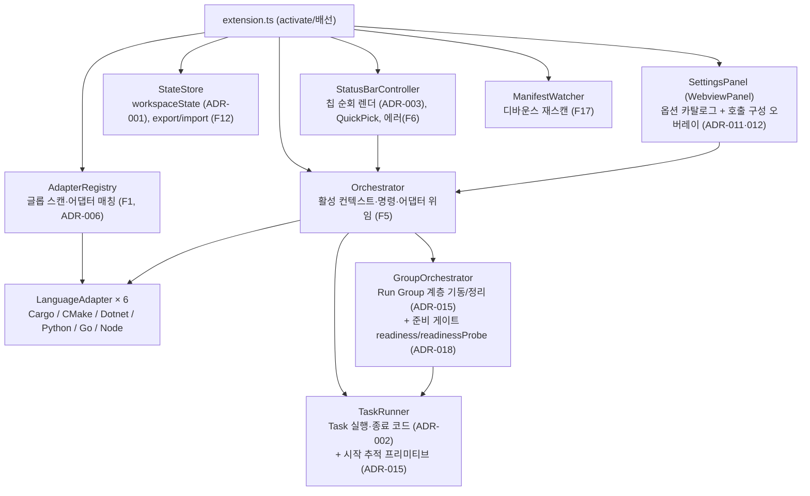
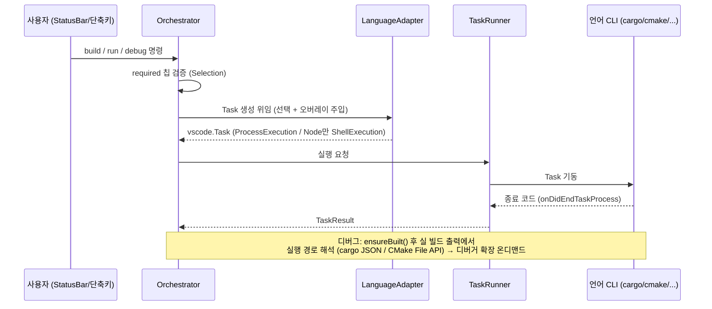
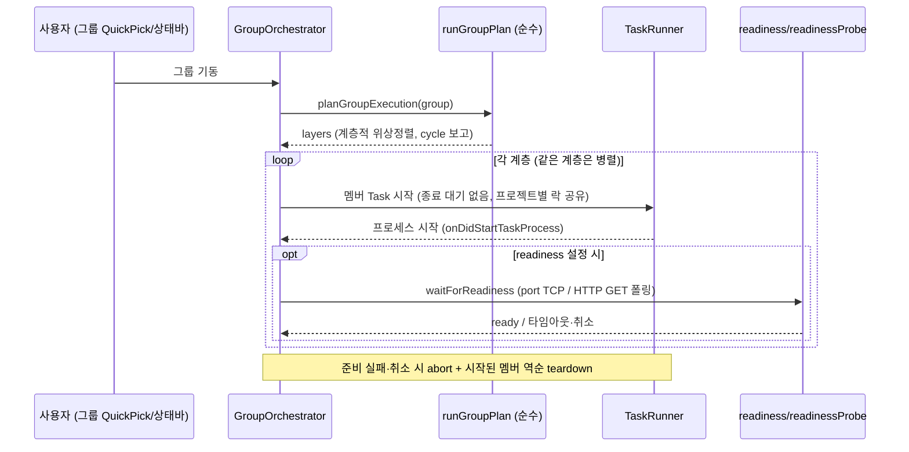

# 시스템 아키텍처 설계서

| 항목 | 내용 |
|------|------|
| 문서번호 | 06 |
| 문서명 | 시스템 아키텍처 설계서 |
| 프로젝트 | DevSwitcher Tools (`devswitcher-tools`) |
| 버전 | v1.0.0 |
| 작성일 | 2026-08-17 |
| 작성 | AI — Claude Code |
| 승인 | Human |
| 기준 문서 | `.cowork/03_design_artifacts/domain_model.md` · `.cowork/03_design_artifacts/tech_stack.md` · `.cowork/03_design_artifacts/adr_registry.md` · `.cowork/03_design_artifacts/adrs/ADR-001~018.md` (전건 Accepted) |

> 생성 방식: **합성** (`export_spec.md` #6). 승인(Accepted)된 ADR만 본문에 반영했으며, 각 섹션 하단에 기준 문서 출처를 표기한다. 기준 문서에 없는 세부사항은 추가하지 않았고, 불명확한 항목은 `미확정`으로 표시했다(§7).

---

## 목차

1. [개요](#1-개요)
2. [아키텍처 원칙 및 불변식](#2-아키텍처-원칙-및-불변식)
3. [컴포넌트 구조 (도메인 모델)](#3-컴포넌트-구조-도메인-모델)
4. [기술 스택](#4-기술-스택)
5. [주요 설계 결정 (ADR)](#5-주요-설계-결정-adr)
6. [데이터 및 실행 흐름](#6-데이터-및-실행-흐름)
7. [미확정 사항](#7-미확정-사항)
8. [섹션별 출처 매핑](#8-섹션별-출처-매핑)

---

## 1. 개요

### 1.1 문서 목적

DevSwitcher Tools의 시스템 아키텍처 — 구성 요소, 관계, 불변식, 기술 스택, 주요 설계 결정(ADR), 데이터/실행 흐름 — 를 공식 산출물로 기술한다.

### 1.2 시스템 개요

DevSwitcher Tools는 **여러 언어(Rust·C++/CMake·C#·Python·Go·Node.js/TypeScript)의 프로젝트를 하나의 상태바 UX로 전환·빌드·실행·디버그하는 VSCode 확장**이다. 이 프로젝트의 "도메인"은 다언어 빌드/디버그 오케스트레이션 자체이며, 확장 호스트 프로세스 하나가 단일 Bounded Context다(ASM-001).

핵심 아키텍처 아이디어:

- **UI는 언어를 모른다** — 언어별 차이는 `LanguageAdapter` + 선언적 `ChipDescriptor[]` 뒤로 흡수된다(ADR-003).
- **확장은 중계(relay) 도구다** — 값(SSOT)은 각 언어의 캐노니컬 파일에만 존재하고, 확장은 포인터·선택 상태·호출 구성 오버레이만 소유하며(ADR-007·011), 사용자의 캐노니컬 파일을 **영구적으로 편집하지 않는다**(ADR-013).
- **저장은 `workspaceState`, 실행은 Task API** — DB 없이 Memento에 저장하고(ADR-001), 빌드/실행은 VSCode Task API로 구동해 종료 코드를 판정한다(ADR-002).
- **Run Group** — 여러 프로젝트를 종속 순서대로 일괄 기동하는 오케스트레이션 계층(ADR-015)과 포트/HTTP 준비 감지(ADR-018)를 갖는다.

> 출처: `domain_model.md` §도입·§7, ADR-003·007·011·013·001·002·015·018. 6개 언어 구성은 프로젝트 컨텍스트(v1.0.0) 및 ADR-014(CMake)·ADR-016(Node, "기존 5개 언어 cargo·dotnet·go·python·cmake" 언급)으로 확인.

### 1.3 기준 문서 및 추적성

| 기준 문서 | 이 문서에서의 역할 |
|-----------|-------------------|
| `domain_model.md` | §2 불변식, §3 컴포넌트 구조·엔티티·서비스·이벤트 |
| `tech_stack.md` | §4 기술 스택 전체 |
| `adr_registry.md` | §5.1 ADR 요약 표(상태·날짜·연관) |
| `adrs/ADR-001~018.md` | §5.2 결정·근거 상세, §2·§6 원칙/흐름 보강 |

---

## 2. 아키텍처 원칙 및 불변식

### 2.1 핵심 원칙

| 원칙 | 내용 | 근거 |
|------|------|------|
| SSOT 파사드 | 값은 캐노니컬 파일(`Cargo.toml` 등)에만 존재. 확장은 "어느 파일을 보는지" 포인터 + 선택 상태만 소유 | ADR-007 |
| 캐노니컬 파일 무편집 (영구 불변식) | 확장은 어떤 버전에서도 사용자의 캐노니컬 빌드 파일을 편집하지 않는다. 계층 ②는 영구 읽기 전용 | ADR-013 |
| 호출 시점 주입 | 컴파일러/링커/출력/env 등 오버레이 값은 파일 편집이 아니라 빌드/실행 호출 시 언어별 메커니즘(cargo `--config`/env, dotnet `-p:`, cmake `-D`, python env)으로 주입 | ADR-011 |
| 선언적 어댑터 | 어댑터 능력은 boolean 고정 구조가 아닌 `ChipDescriptor[]` 배열 선언 — UI 코드 무변경으로 언어 확장(NFR-005) | ADR-003 |
| 네이티브 도구 위임 | 프로젝트 생성(F20)·경로 해석 등은 확장이 직접 구현하지 않고 언어 네이티브 도구(cargo/dotnet/cmake 등)에 위임 | ADR-005·010·014 |
| 의존 최소화·온디맨드 | `extensionDependencies` 하드 의존 미사용. 디버거 확장 등은 최초 사용 시점에 3단계(완전 자동/반자동/안내)로 온디맨드 처리, Graceful Degradation(NFR-003) | ADR-009 |
| 원격 안전 | `extensionKind: ["workspace"]` — 경로는 `vscode.Uri` 기반, OS 경로 형식 가정 금지, 매 환경 재진단 | ADR-008 |
| 셸 인젝션 차단 (NFR-002) | 실행은 `ProcessExecution`(배열 인자, 셸 無)이 기본. 문서화된 예외 2건: 빌드 전/후 이벤트(NFR-002a, ADR-011)와 Node 어댑터의 배열형 `ShellExecution`(ADR-016 — 인자별 인용으로 인젝션 차단 목표는 유지) | ADR-002·011·016 |

### 2.2 불변식 (Invariants)

| ID | 불변식 | 근거 |
|----|--------|------|
| INV-1 | **SSOT**: 값은 캐노니컬 파일에만, 확장은 포인터+선택만 보유 | ADR-007 |
| INV-2 | **어댑터 무지 UI**: StatusBar/SettingsPanel은 특정 언어를 모른다 — `ChipDescriptor[]`만 순회 | ADR-003 |
| INV-3 | **단일 갱신 경로**: 매니페스트 변경(외부 편집·F20 생성)은 모두 ManifestWatcher 재스캔 경로로 수렴(F17). 확장은 캐노니컬 파일을 편집하지 않으므로 내부발 쓰기 경로가 없다 | ADR-013 |
| INV-4 | **한 창 = 한 환경**: 한 VSCode 창은 하나의 실행 환경에만 연결 | — |
| INV-5 | **프로젝트별 선택 독립**: 프로젝트 전환 시 각자의 마지막 선택 복원 | — |
| INV-6 | **호출 구성 = 파일 무편집**: 오버레이(계층 ③)는 `(프로젝트 × 구성)`별로 `workspaceState`에 저장하고 호출 시 주입만 한다 | ADR-011 |

> 출처: `domain_model.md` §5 (INV-1~6 원문), ADR-007·003·013·011.

---

## 3. 컴포넌트 구조 (도메인 모델)

### 3.1 컴포넌트 구성도

아래 다이어그램의 **골격은 `domain_model.md` §2(Gate 3 승인, v1 기준)** 이며, 이후 승인된 ADR로 추가된 구성 요소(GroupOrchestrator·준비 감지 모듈·어댑터 6종 확장)를 출처 표기와 함께 반영했다.

**의존 방향**: UI(StatusBar/SettingsPanel) → Orchestrator → Adapter. **역방향 금지.** Run Group은 순수 오케스트레이션 계층으로, 어댑터/UI는 그룹을 모른다(ADR-015).

> 출처: `domain_model.md` §2(골격·의존 방향), ADR-015(GroupOrchestrator·TaskRunner 시작 추적), ADR-018(`core/readiness.ts`·`core/readinessProbe.ts`), ADR-012(SettingsPanel = WebviewPanel). 어댑터 6종은 프로젝트 컨텍스트(v1.0.0)·ADR-014·016 기준 — `domain_model.md` 원문 다이어그램은 v1 시점(4언어) 미갱신 상태다(§7 참조).

### 3.2 핵심 엔티티 / 값

| 구분 | 타입 | 내용 |
|------|------|------|
| Entity | `ProjectInfo` | 감지된 프로젝트. `id = adapterId:상대경로`(기계 독립, F12 공유에 유리 — ADR-006), name, adapterId, manifestPath, workspaceFolder |
| Value | `Selection` | 프로젝트별 선택 상태. projectId, values(chipId→ChipValue), runArgs. 값이 아니라 **선택만** 보유(SSOT, ADR-007) |
| Value | `ChipDescriptor` | 어댑터가 선언하는 칩. id·icon·label·multiSelect·required·listItems·format·defaultValue (ADR-003) |
| Value | `InvocationConfig` | 호출 구성 오버레이(계층 ③). `(projectId × profile)`별 compiler·linker·outputDir·env·runArgs·preBuild·postBuild. 파일 미편집, 호출 시 주입 (ADR-011) |
| Value | `OptionSpec` | 옵션 카탈로그 항목. 어댑터가 선언하는 옵션 메타데이터(설명·예제·타입·허용값·주입방식). 설정 페이지가 렌더 (ADR-012) |
| Value | `RunGroup` / `RunGroupMember` | Run Group 정의. `RunGroup { id, name, members }`, `RunGroupMember { projectId, dependsOn[], readiness? }`. Run 전용. `PersistedState.groups`(workspaceState)에 additive 저장 (ADR-015·018) |
| Value | `ReadinessProbe` | 멤버별 준비 조건. `{ kind: 'port'; port; timeoutMs }` 또는 `{ kind: 'http'; url; expectStatus?; timeoutMs }`. 필드 부재 = 프로세스 시작 준비 (ADR-018) |

**값의 원천**: 프로파일/아키텍처/타깃의 실제 정의(계층 ②)는 `Cargo.toml` 등 캐노니컬 파일에만 존재한다. 확장은 포인터 + 선택 + 호출 오버레이만 소유한다.

> 출처: `domain_model.md` §3 (ProjectInfo~OptionSpec), ADR-015 §Decision(RunGroup 모델), ADR-018 §Decision(ReadinessProbe).

### 3.3 도메인 서비스

| 서비스 | 책임 | 입력 | 출력 | 근거 |
|--------|------|------|------|------|
| AdapterRegistry | 워크스페이스 글롭 스캔 → 어댑터 매칭 | workspaceFolders | `{project, adapter}[]` | ADR-006 |
| Orchestrator | 명령 처리, required 칩 검증, 어댑터 위임 | 명령 + 활성 컨텍스트 | Task/Debug 기동 | — |
| TaskRunner | Task 실행·종료 코드 대기(일회성) + 시작 추적 프리미티브(장기 실행). 프로젝트별 락 공유 | `vscode.Task` | `TaskResult` | ADR-002·015 |
| GroupOrchestrator | Run Group 계층 단위 기동·준비 게이트·역순 teardown | RunGroup + 실행 계획 | 그룹 기동/정리 | ADR-015·018 |
| StateStore | 선택 상태·그룹 저장·복원·reconcile·export/import | PersistedState | Selection | ADR-001 |
| ManifestWatcher | 매니페스트 변경 감지 → 재스캔 | FS 이벤트 | 재스캔 트리거 | — |
| Doctor | 전제조건 점검·복구 액션(의존성 3단계 처리) | 활성 어댑터 | 진단 목록 | ADR-009 |

> 출처: `domain_model.md` §4(AdapterRegistry~Doctor 원문), ADR-015(GroupOrchestrator·TaskRunner 이중 프리미티브).

### 3.4 언어 어댑터 구성 (v1.0.0)

| 어댑터 | 실행 프리미티브 | 특기 사항 | 근거 |
|--------|----------------|-----------|------|
| Cargo (Rust) | `ProcessExecution` | 디버그 경로는 `cargo build --message-format=json`의 `executable` 필드 파싱(경로 조합 금지). 디버거는 CodeLLDB 온디맨드 | ADR-005·009 |
| CMake (C++) | `ProcessExecution` | 자체 `cmake` CLI 구동(CMake Tools 미위임). configure(`-S -B -D`)/build(`--build --target [--config]`) 2단계, 타깃·실행 경로는 CMake File API(codemodel-v2). `CMakePresets.json` 읽기 전용 파싱 → Preset 칩. 디버거는 컴파일러 ID로 자동판별(MSVC→cppvsdbg, GNU/Clang→cppdbg, override로 CodeLLDB) | ADR-014 |
| Dotnet (C#) | `ProcessExecution` | `msbuild -getProperty` / `-p:` 주입 패턴 | ADR-014 §Context |
| Python | `ProcessExecution` | 인터프리터 직접 실행. 빌드 없음(`actions.build=false`) — 설정 페이지 카테고리도 어댑터 선언으로 분기(INV-2 리트머스) | ADR-012·014 §Context |
| Go | `ProcessExecution` | ADR-016에서 ProcessExecution 유지 언어로 확인. 전용 설계 ADR 없음(§7 미확정) | ADR-016 §Context |
| Node.js / TypeScript | **배열형 `ShellExecution`** (NFR-002 문서화된 예외) | npm/pnpm/yarn이 Windows에서 `.cmd` 심이라 셸-less spawn 불가(Node 24 `EINVAL`, CVE-2024-27980 완화책). 배열 인자를 VSCode가 개별 인용해 인젝션 차단 목표 유지. npm 스크립트(`package.json scripts`) 기반 build/run | ADR-016 |

> 출처: ADR-005·009·012·014·016. v1 시점 `domain_model.md`는 "Cargo(구현) / CMake·Dotnet·Python(스텁)"으로 기재 — 이후 실구현 전환은 ADR-014(CMake)·ADR-016(Node·5언어 패턴 언급) 기준.

### 3.5 도메인 이벤트

| 이벤트 | 트리거 | 처리 |
|--------|--------|------|
| 프로젝트 감지 변경 | 매니페스트 create/delete, 폴더 추가/제거 | 재스캔 → reconcile → 렌더 |
| 매니페스트 변경 | `Cargo.toml` change 등 | 캐시 무효화 → 렌더 |
| 선택 변경 | 칩 QuickPick 선택 | StateStore 저장 → 렌더 |
| 프로젝트 생성 (F20) | 시작 마법사 완료 | 새 매니페스트 감지 → 자동 등장 |

> 출처: `domain_model.md` §6 원문.

---

## 4. 기술 스택

### 4.1 확정 기술스택

| 영역 | 기술 | 버전/사양 | 선정 ADR | 비고 |
|------|------|----------|---------|------|
| 주 언어 | TypeScript | — | — | 확장 구현 언어 |
| 런타임 | Node.js | LTS 18+ | — | 확장 개발/빌드 |
| 대상 플랫폼 | VSCode Extension API | `engines.vscode ^1.90.0` | ADR-002·008 | `extensionKind: ["workspace"]`(원격) |
| 번들러 | esbuild | — | — | `yo code` 기본 번들러 |
| 패키지 매니저 | npm | — | — | |
| 스캐폴드 | Yeoman + `generator-code` | — | — | `yo code` |
| 실행 방식 | VSCode Task API (`ProcessExecution`) | — | ADR-002 | 종료 코드·problem matcher. Node 어댑터만 배열형 `ShellExecution` 예외(ADR-016) |
| 상태 저장 | `workspaceState`(Memento) | 키 `devSwitcher.state.v1` | ADR-001 | DB 미사용 |
| TOML 파서 | `smol-toml`(읽기) | — | ADR-007 | 원문에 병기된 "라인 치환(쓰기)" 용도는 ADR-011·013(파일 무편집 영구 불변식)으로 폐지 — 읽기 전용만 유효 |
| JSONC 파서 | `jsonc-parser` | — | ADR-007 | C++ 프리셋 등(원문 표기: 향후) |
| XML 파서 | `fast-xml-parser` | — | ADR-007 | `.csproj`(원문 표기: 향후) |
| 디버거(위임) | CodeLLDB (`vadimcn.vscode-lldb`) | 온디맨드 | ADR-009 | Rust 디버깅, 하드의존 아님. C++은 cpptools/CodeLLDB 동적 판별(ADR-014) |
| 테스트 (단위) | 순수 함수 (VSCode 무의존) | — | — | `cargoBridge`, `runGroupPlan`, `readiness` 등 |
| 테스트 (통합) | `@vscode/test-electron` + `@vscode/test-cli` | — | — | |
| 배포 | `@vscode/vsce` → VSIX | — | — | 개인용 → Open VSX/Marketplace 검토 |
| 외부 CLI 의존 | cargo / rustup 등 언어별 CLI | — | ADR-009 | Doctor 재진단, 온디맨드 |

> `선정 ADR`이 비어 있는 항목은 단일 자명 선택(스캐폴드 기본값 등)으로 별도 ADR 불요.

### 4.2 F20 프로젝트 생성 — 네이티브 도구 위임

| 언어 | 생성 도구/방식 | 근거 |
|------|---------------|------|
| Rust | `cargo new` / `cargo init` | ADR-010 |
| C# | `dotnet new console` | ADR-010 |
| C++ | cmake 최소 템플릿(`CMakeLists.txt` + `main`) | ADR-010 |
| Python | 기본 `pyproject.toml` 생성 | ADR-010 |
| Go / Node.js | 기준 문서(`tech_stack.md`) 미기재 — **미확정** (§7) | — |

확장은 오케스트레이션만 담당하고 실제 파일 생성은 네이티브 도구가 수행한다(SSOT·위임 원칙). F20의 신규 파일 **작성**은 "빈 폴더에 신규 생성"이므로 파일 무편집 불변식(ADR-013)의 예외가 아니라 무관 사항이다.

### 4.3 검토했으나 채택하지 않은 기술

| 기술 | 검토 사유 | 미채택 사유 | 관련 ADR |
|------|----------|-----------|---------|
| `settings.json` 선택 상태 저장 | 개념설계 원안 | `.vscode/` 커밋 시 개인 선택 충돌·diff 오염 | ADR-001 |
| 터미널 명령 전송(`runInTerminal`) | 개념설계 원안 | 종료 코드 못 받음 → ensureBuilt 불가 | ADR-002 |
| `target/<triple>/<profile>/<bin>` 경로 조합 | 개념설계 원안 | dev→debug 폴더명·커스텀 프로파일·`CARGO_TARGET_DIR`에 깨짐 | ADR-005 |
| `extensionDependencies`(CodeLLDB 하드의존) | v1.0 원안 | 다언어 확장에 디버거 강제 설치 부적절 | ADR-009 |
| boolean 5개 고정 Capabilities | 개념설계 원안 | 새 칩 추가 시 인터페이스 깨짐 | ADR-003 |
| CMake Tools 확장 위임 | MS-012 검토 | 코어 기능 하드의존·상태 이원화·ADR-013 충돌 | ADR-014 |
| 캐노니컬 파일 국소 편집(구 §8.7) / 오버레이 파일 승격(C-3) | 초기 설계·v2 이월안 | 파일 소유/파괴 위험·SSOT 긴장·export/import(F12)와 중복 → 폐기 | ADR-011·013 |
| 인페이지 키 캡처 → `keybindings.json` 직접 편집 | MS-017 검토 | VSCode 런타임 키바인딩 API 부재·사용자 config 편집 취약 | ADR-017 |

> 출처: §4 전체 — `tech_stack.md`(확정 표·F20 표·미채택 표 상단 5행 원문), 미채택 표 하단 3행은 ADR-014·011·013·017의 기각 옵션에서 보강.

---

## 5. 주요 설계 결정 (ADR)

### 5.1 ADR 요약 표

전 18건 **Accepted** 상태다(`adr_registry.md`, 2026-08-17 기준). ADR-001~009는 상세설계서 §2 DD-01~09의 승격이다.

| ADR | 결정 | 날짜 | 핵심 연관 |
|-----|------|------|----------|
| ADR-001 | 선택 상태를 `workspaceState`(Memento)에 저장 | 2026-08-13 | ADR-007 |
| ADR-002 | 빌드/실행을 VSCode Task API로 실행 | 2026-08-13 | ADR-005 |
| ADR-003 | Capabilities를 선언적 칩 배열(`ChipDescriptor[]`)로 | 2026-08-13 | 설계 핵심(INV-2) |
| ADR-004 | v1 범위에 F15(features)·F16(run args)·F17(파일 감시) 포함 | 2026-08-13 | — |
| ADR-005 | 디버그 경로를 cargo JSON 메시지로 해석 | 2026-08-13 | ADR-002·008 |
| ADR-006 | 감지를 글롭 스캔 + 멀티루트로 | 2026-08-13 | ADR-008 |
| ADR-007 | SSOT 파사드 — 값은 캐노니컬 파일에만 | 2026-08-13 | ADR-001·011·013 |
| ADR-008 | 원격 환경 지원 (`extensionKind: ["workspace"]`) | 2026-08-13 | ADR-005·006·009 |
| ADR-009 | 의존성 온디맨드 3단계 (`extensionDependencies` 미사용) | 2026-08-13 | ADR-008 |
| ADR-010 | 프로젝트 시작 마법사 도입 (스위처 + 이니셜라이저, F20) | 2026-08-13 | ADR-003·009 |
| ADR-011 | 호출 구성 오버레이 (파일 무편집, `--config`/env 주입) | 2026-08-15 | ADR-007 보완 |
| ADR-012 | 설정 페이지(WebviewPanel) + 선언적 옵션 카탈로그 | 2026-08-15 | ADR-003 연장 |
| ADR-013 | 캐노니컬 파일 무편집 = 영구 불변식 (C-3 폐기) | 2026-08-16 | ADR-011 종결 |
| ADR-014 | CMake 어댑터는 자체 `cmake` CLI 구동 (File API) | 2026-08-16 | ADR-005·009·013 |
| ADR-015 | Run Group 실행 모델 (준비=프로세스 시작, 계층적 위상정렬) | 2026-08-17 | ADR-001·002·018 |
| ADR-016 | Node 스크립트는 배열형 ShellExecution으로 실행 (NFR-002 예외) | 2026-08-17 | ADR-002 |
| ADR-017 | 키보드 단축키 = 정적 기본값 + 네이티브 편집기 딥링크 | 2026-08-17 | ADR-013 정신 |
| ADR-018 | Run Group 준비 감지 = 포트/HTTP 헬스체크 (멤버별 게이트) | 2026-08-17 | ADR-015 후속 |

### 5.2 핵심 ADR별 결정·근거 요약

#### A. 상태 저장과 SSOT — ADR-001 · 007 · 011 · 013

- **ADR-001**: 선택 상태(프로파일/아키텍처/features/타깃)는 `context.workspaceState`에 저장한다. `settings.json` 저장안은 `.vscode/` 커밋 시 개인 선택이 팀과 충돌하고 diff를 오염시켜 기각. 공유가 필요하면 F12 export/import로만 명시적 파일화. 부수 이점: Windows 창/WSL 창이 선택 상태를 독립 기억.
- **ADR-007**: 값은 캐노니컬 파일에만 존재(SSOT 파사드). 값 이중화가 없어 원천과 확장 상태가 어긋날 여지가 없다. Trade-off: 어댑터마다 파일 포맷 파싱 구현 필요.
- **ADR-011**: 컴파일 옵션·출력·링커·env·빌드 전후 이벤트는 캐노니컬 파일 편집 없이 `(projectId × profile)`별 **호출 구성 오버레이**로 저장하고 호출 시 언어별 메커니즘으로 주입한다. 3계층 분리(§6.1). 최종 명령은 설정 페이지에 미리보기로 노출(투명성). Trade-off: 오버레이는 DevSwitcher 호출 경로에만 적용(수동 CLI 미적용 — 설계된 동작).
- **ADR-013**: ADR-011이 v2로 이월했던 "오버레이 → 파일 영구 반영(C-3)"을 **폐기**하고 파일 무편집을 영구 불변식으로 확정. 근거: 중계 도구 정체성, 사용자 파일 무결성(주석/포맷/머지) 보호, 영속화 필요는 F12가 이미 충족. `LanguageAdapter.persistSetting` 계약 제거로 불변식을 코드로 강제.

#### B. 실행 모델 — ADR-002 · 005 · 016

- **ADR-002**: 빌드/실행은 Task API. 터미널 전송은 종료 코드를 못 받아 `ensureBuilt()`(디버그 전 최신 빌드 보장)가 불가능해 기각. `onDidEndTaskProcess` 종료 코드 감지 + problem matcher 연동. 어댑터는 `vscode.Task` 생성까지, 실행·대기는 `TaskRunner` 전담. `ProcessExecution` 배열 인자로 셸 이스케이프 원천 차단(NFR-002).
- **ADR-005**: 디버그 실행 파일 경로는 `cargo build --message-format=json`의 `executable` 필드 파싱으로 해석. 경로 조합은 dev→debug 폴더명·커스텀 프로파일·`CARGO_TARGET_DIR`에 전부 깨져 기각 — cargo가 알려주는 경로를 쓰면 세 문제가 설계에서 소멸하고 원격 환경에도 무관.
- **ADR-016**: Node 어댑터만 배열형 `ShellExecution` 사용. Windows에서 npm/pnpm/yarn은 `.cmd` 심이라 셸-less spawn이 불가(Node 24 실측 `EINVAL`, CVE-2024-27980 완화책). NFR-002의 실질 목표(인젝션 차단)는 "배열 인자 개별 인용"에서 나오므로 배열형 ShellExecution으로 보존 — NFR-002a(빌드 전후 이벤트)와 동급의 문서화된 예외. Raw 명령줄 문자열 사용 금지. 나머지 5개 언어는 `ProcessExecution` 유지.

#### C. 어댑터·UI 모델 — ADR-003 · 006 · 012 · 014

- **ADR-003**: 어댑터 능력을 boolean 5개 고정 구조체 대신 선언적 칩 배열로. 상태바는 `chips` 배열을 순회하며 그리므로 어댑터 추가 시 UI 코드 무변경(NFR-005) — 이 설계의 핵심.
- **ADR-006**: 프로젝트 감지는 `workspace.findFiles` 글롭 스캔(+`target/` 제외) + 멀티루트 순회. `ProjectInfo.id = adapterId:상대경로`로 기계 독립. Uri 기반이라 원격 안전.
- **ADR-012**: 설정 UI는 `WebviewPanel` "설정 페이지"(모달 다이얼로그 아님 — VSCode에 리치 폼 모달 부재). 옵션 카탈로그(설명·예제·타입·허용값)와 카테고리를 어댑터가 선언하고 UI는 렌더만 — ADR-003의 연장. 역할 분담: 칩/QuickPick = 빠른 전환, 설정 페이지 = 깊은 구성.
- **ADR-014**: CMake 어댑터는 CMake Tools 확장에 위임하지 않고 자체 `cmake` CLI 구동. configure/build 2단계에 오버레이를 `-D`/`--config`로 주입, 타깃·실행 경로는 CMake File API(codemodel-v2)로 해석(추측 없음). 디버거는 File API `toolchains`의 컴파일러 ID로 자동판별(WSL/MinGW/Linux/Mac 자동대응). `CMakePresets.json`은 읽기 전용 파싱으로 Preset 칩 노출. 근거: 3개 언어 선례와의 아키텍처 일관성, 파일 무편집(ADR-013), 빌드/실행 확장 무의존(ADR-009).

#### D. 환경·의존성 — ADR-008 · 009

- **ADR-008**: WSL·Dev Containers·Remote-SSH를 v1 지원 범위로. `extensionKind: ["workspace"]`로 원격 연결 시 항상 원격 측 실행. ADR-005·006이 이미 원격 안전이라 비용이 낮았다. 한계: "한 창 = 한 환경"(INV-4).
- **ADR-009**: 어댑터별 필요 확장은 최초 사용 시점에 온디맨드 확인·자동 설치. 의존성은 3단계(완전 자동/반자동/안내만)로 분류(Doctor, F19). Graceful Degradation — 없는 것에 의존하는 기능만 비활성화.

#### E. 범위·기능 결정 — ADR-004 · 010 · 017

- **ADR-004**: F15(features 칩)·F16(run args)·F17(매니페스트 감시)를 v1에 포함 — 일정 +2일 미만으로 실사용성이 크게 상승.
- **ADR-010**: "새 프로젝트 시작 마법사"(F20) 도입 — DevSwitcher를 스위처이자 이니셜라이저로 확장. "도구 부재는 복구되는데 매니페스트 부재는 안 되던" 비대칭 해소. 파일 생성은 네이티브 도구에 위임하고 확장은 오케스트레이션만. 생성 후 ManifestWatcher가 감지해 자동 등장.
- **ADR-017**: 키보드 단축키는 정적 `contributes.keybindings` 기본값(`Ctrl+Alt+<글자>`, `when: devSwitcher.hasProjects`) + 변경은 VSCode 네이티브 Keyboard Shortcuts 편집기로 딥링크 위임. 근거: VSCode에 런타임 키바인딩 등록 API가 없고, `keybindings.json` 직접 편집은 취약하며 ADR-013 정신에 반함. F5·Ctrl+Shift+B 등 내장 키는 오버라이드하지 않음.

#### F. Run Group — ADR-015 · 018

- **ADR-015**: Run Group은 여러 프로젝트를 `dependsOn` 그래프의 **계층적 위상정렬**(Kahn)로 계층 단위 기동(같은 계층 병렬). 멤버는 Run 전용(장기 실행 서비스)이므로 "준비" 신호 = **프로세스 시작**(`onDidStartTaskProcess`) — 종료 대기 모델로는 첫 서비스에서 영원히 블록되기 때문. `TaskRunner`에 기존 종료 대기와 별도의 "시작 추적" 프리미티브를 추가하되 프로젝트별 락은 공유. teardown은 추적한 `TaskExecution` 종료. 그룹 정의는 `PersistedState.groups`(additive)로 저장, 프로파일 export(F12)에는 미포함(v1 의도적 범위).
- **ADR-018**: 준비 신호를 선택적 **포트 open / HTTP 상태코드 게이트**로 강화. `RunGroupMember.readiness?`는 optional·additive — 미설정 시 프로세스 시작 준비 유지(하위호환·마이그레이션 불요). 순수 폴링 루프(`core/readiness.ts`, now/sleep/signal 주입)와 I/O 프로브(`core/readinessProbe.ts`, Node 내장 `net`/`http(s)`만 — ADR-009)를 분리. 타임아웃 시 그룹 abort + 역순 teardown(준비 실패 = 종속 서비스 부재), 준비 대기는 취소 가능(`CancellationToken` → `AbortSignal`). HTTP는 지정 상태코드(기본 200) 정확 일치.

> 출처: §5 전체 — `adr_registry.md`(표), `adrs/ADR-001~018.md`(결정·근거 원문 요약).

---

## 6. 데이터 및 실행 흐름

### 6.1 3계층 설정 모델

| 계층 | 저장 위치 | 내용 | 소유/편집 |
|------|----------|------|-----------|
| ① 확장 설정 | `settings.json` (`contributes.configuration`) | 확장 동작(scan.exclude 등) | VSCode 표준 설정 |
| ② 프로필 정의 (SSOT) | 캐노니컬 파일(`Cargo.toml`·`CMakeLists.txt`·`*.csproj`·`pyproject.toml`·`package.json` 등) | `opt-level`·lto·features·bin 이름 등 "프로젝트의 진실" | **영구 읽기 전용** (ADR-013) |
| ③ 호출 구성 오버레이 | `workspaceState` | RUSTFLAGS·출력경로·링커·env·runArgs·전후 명령. `(projectId × profile)` 키 | 확장이 소유, 호출 시 주입만 |

구성(profile) 목록은 계층 ②에서 읽어오며 확장이 지어내지 않는다. 오버레이 주입 시점(configure/build/run)은 어댑터가 소유한다.

> 출처: ADR-011 §Decision(3계층·키·주입), ADR-013(계층 ② 영구 읽기 전용).

### 6.2 빌드/실행/디버그 흐름

- 어댑터는 Task 객체 생성까지만 책임지고, 실행·대기·종료 코드 감지는 `TaskRunner`가 전담한다(ADR-002).
- 사용자 대면 빌드는 Task(문제 매처), 디버그용 경로 해석은 캡처 실행으로 역할이 분리된다(ADR-005).
- 오버레이(계층 ③)는 이 시점에 언어별 메커니즘(cargo `--config`/env, dotnet `-p:`, cmake `-D`, python env)으로 접혀 들어간다(ADR-011).

> 출처: ADR-002(TaskRunner 역할 분담), ADR-005(경로 해석·역할 분리), ADR-011(주입), ADR-014(CMake File API), ADR-016(Node 예외).

### 6.3 Run Group 기동 흐름

- 그룹은 어댑터의 기존 `createRunTask`를 재사용해 기동하며, 어댑터/UI는 그룹을 모른다(INV-2).
- 다음 계층은 이전 계층 멤버가 전부 "준비"된 뒤 시작한다. 준비 = 프로세스 시작(기본, ADR-015) 또는 멤버별 포트/HTTP 게이트(ADR-018).

> 출처: ADR-015 §Decision(계획·실행·teardown), ADR-018 §Decision(게이트·취소·abort).

### 6.4 감지·상태 복원 흐름

1. **감지**: `AdapterRegistry`가 워크스페이스 폴더별로 매니페스트 글롭(`**/Cargo.toml` 등, `target/` 제외)을 스캔하고 어댑터에 파일 목록(`listProjects(manifests: Uri[])`)을 넘겨 프로젝트를 확정한다(ADR-006).
2. **복원**: `StateStore`가 `workspaceState`(키 `devSwitcher.state.v1`)에서 `PersistedState`를 로드해 프로젝트별 `Selection`을 reconcile한다. `groups` 부재 시 `[]`로 정규화(additive 호환, ADR-001·015).
3. **감시**: `ManifestWatcher`가 매니페스트 create/delete/change를 디바운스 감지해 재스캔을 트리거한다 — 외부 편집이든 F20 생성이든 모든 변경이 이 단일 경로로 수렴한다(INV-3).
4. **공유**: 선택 상태의 클론 간 공유는 F12 export/import로만 명시적으로 수행한다(ADR-001). Run Group 정의는 v1 export 미포함(ADR-015).

> 출처: ADR-006(스캔), ADR-001(저장·F12), ADR-015(groups 정규화·export 제외), `domain_model.md` §4·§6(Watcher·reconcile).

---

## 7. 미확정 사항

| # | 항목 | 내용 | 상태 |
|---|------|------|------|
| 1 | 혼재 워크스페이스 칩 전환 UX (OQ-001) | 여러 언어 프로젝트 혼재 시 칩 표시/숨김 전환이 혼란스러운지 미검증 | Deferred (`domain_model.md` §8) |
| 2 | Go 어댑터 설계 근거 | Go 어댑터는 ADR-016에서 `ProcessExecution` 유지 언어로만 언급될 뿐, 전용 ADR·도메인 모델 갱신이 기준 문서에 없다. 세부 설계(칩 구성·경로 해석 등)는 이 문서에서 기술 불가 | 미확정 |
| 3 | Go·Node의 F20 생성 도구 | `tech_stack.md` F20 표는 Rust·C#·C++·Python 4개 언어만 기재. Go/Node 프로젝트 생성 위임 방식은 기준 문서 미기재 | 미확정 |
| 4 | `domain_model.md` 컴포넌트 다이어그램 최신화 | 원문 다이어그램은 v1 시점(Cargo 구현 + 3언어 스텁, Gate 3 승인) 기준. §3.1의 6어댑터·GroupOrchestrator 반영본은 ADR-014·015·016·018로부터의 합성이며, 기준 문서 자체는 미갱신 | 미확정 (기준 문서 갱신 필요) |
| 5 | `tech_stack.md`의 TOML "라인 치환(쓰기)" 항목 | ADR-011·013(파일 무편집 영구 불변식)과 상충 — 쓰기 용도는 폐지된 것으로 판단되나 기준 문서 원문이 미갱신 | 미확정 (기준 문서 갱신 필요) |
| 6 | `jsonc-parser`·`fast-xml-parser` 현행 사용처 | `tech_stack.md`에 "(향후)"로 표기. ADR-014의 CMakePresets 파싱·File API JSON과의 실제 매핑은 기준 문서에서 확인 불가 | 미확정 |
| 7 | CMake 커스텀 build type | 표준 4종(Debug/Release/RelWithDebInfo/MinSizeRel) 정적 목록만 v1 — "커스텀은 후속"(ADR-014) | 후속 과제 |
| 8 | Run Group export | 그룹 정의·준비 조건은 프로파일 export(F12) 미포함 — v1 의도적 범위, 필요 시 후속(ADR-015·018) | 후속 과제 |

---

## 8. 섹션별 출처 매핑

| 섹션 | 기준 문서 |
|------|-----------|
| §1 개요 | `domain_model.md` 도입·§7, ADR-001·002·003·007·011·013·015·018, 프로젝트 컨텍스트(v1.0.0·6언어) |
| §2 원칙·불변식 | `domain_model.md` §5(INV-1~6 원문), ADR-002·003·005·007~011·013·014·016 |
| §3 컴포넌트 구조 | `domain_model.md` §1~§4·§6·§7(골격 원문), ADR-005·006·009·012·014·015·016·018(확장 반영) |
| §4 기술 스택 | `tech_stack.md`(전체 표 원문), ADR-010(F20), ADR-011·013·014·017(미채택 보강) |
| §5 설계 결정 | `adr_registry.md`(요약 표), `adrs/ADR-001~018.md`(상세 — 전건 Accepted만 반영) |
| §6 데이터/실행 흐름 | ADR-001·002·005·006·011·013·014·015·016·018, `domain_model.md` §4·§6 |
| §7 미확정 | `domain_model.md` §8(OQ-001), 기준 문서 간 공백·상충 식별 결과 |

---

*본 문서는 `.cowork/07_delivery/export_spec.md`의 합성 규칙에 따라 생성된 공식 산출물이다. 기준 문서와의 추적성이 훼손되는 수정은 기준 문서 갱신 후 재생성으로 반영한다.*
